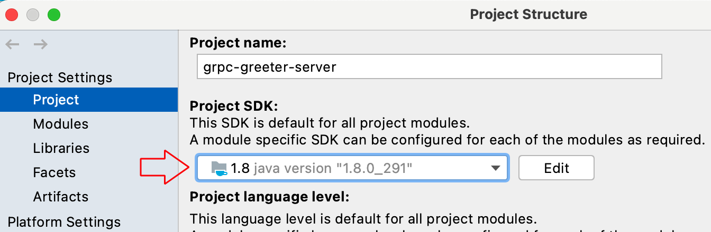
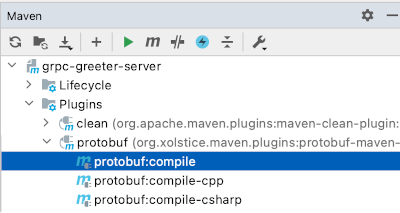
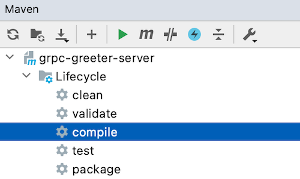
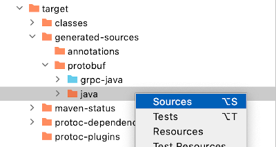
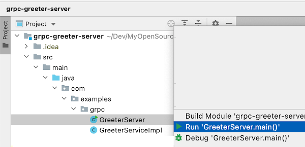
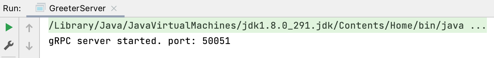
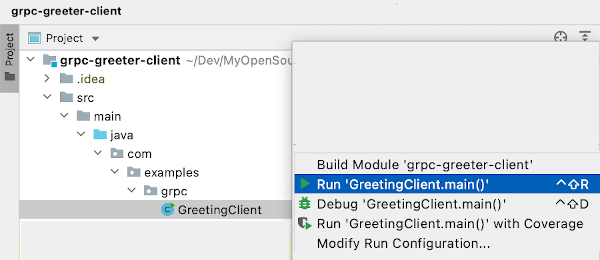
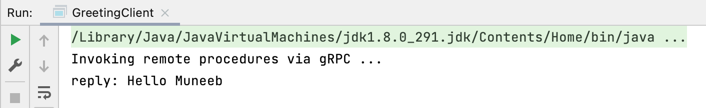

# grpc-examples

# Java Examples

## How to build and run the examples
Clone this repository and run gRCP server and client projects.
```
git clone https://github.com/muneebsa/grpc-examples.git
WORK_DIR: ~/Dev/grpc
```
It is assumed that you have cloned the repository in your favourite working dir {{WORK-DIR}}.
### Running gRPC Server

#### 1. Import the project into an IDE
Open the below project folder into your favouite IDE.
```
{WORK_DIR}/grpc-examples/java/grpc-greeter-server
```
The below instructions are based on using the IntelliJ IDE. For other IDEs like Eclipse, you may need to adjust the steps/instructions accordingly.

#### 2. Select a compatible JDK
The examples were tested with JDK 1.8. You may try higher version if you like.


#### 3. Compile the gRPC protobuf (proto) file


#### 4. Compile the server (java) code


#### 5. Add generated code to the project



#### 6. Run the server (class)

Once the server run is successfull, you will see the below message in the console.


## Running gRPC Client

#### 1. Import the project into an IDE
Open the below project folder into your favouite IDE.
```
{WORK_DIR}/grpc-examples/java/grpc-greeter-client
```
The below instructions are based on using the IntelliJ IDE. For other IDEs like Eclipse, you may need to adjust the steps/instructions accordingly.

#### 2. Setup the project qand compile
Follow the instructions #2 through #5 as outlined in the **Running gRPC Server - Java** section.

#### 3. Run the client (class)

Once the client run is successfull, you will see the below message in the console.


